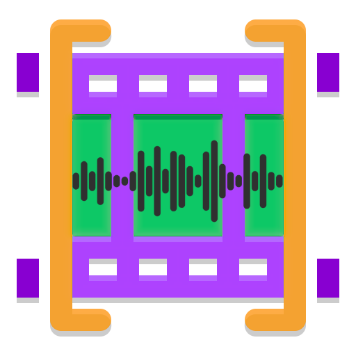

<div align="center">
  

  <h1>CLIPPED</h1>

  <p><strong>Metadata-aware audio clipping and video generation for macOS music workflows.</strong></p>

  <p>
    <a href="https://www.python.org/"></a>
    <a href="https://ffmpeg.org/"></a>
    <a href="https://www.apple.com/macos/"></a>
    <a href="CHANGELOG.md"></a>
  </p>

  <p>
    <a href="#quick-start">Quick Start</a> |
    <a href="#examples">Examples</a> |
    <a href="#video-templates">Templates</a> |
    <a href="#keyboard-maestro">Keyboard Maestro</a> |
    <a href="#configuration">Configuration</a>
  </p>
</div>

---

## Table of Contents

- [Quick Start](#quick-start)
- [Examples](#examples)
- [What It Does](#what-it-does)
- [Core Workflows](#core-workflows)
- [Video Templates](#video-templates)
- [Platform Profiles](#platform-profiles)
- [Keyboard Maestro](#keyboard-maestro)
- [Configuration](#configuration)
- [Project Structure](#project-structure)
- [Developer Commands](#developer-commands)
- [Adding a Template](#adding-a-template)
- [Troubleshooting](#troubleshooting)

## Quick Start

```bash
git clone https://github.com/deathrashed/clipped.git ~/Scripts/Riley/clipped
cd ~/Scripts/Riley/clipped
python -m venv .venv
source .venv/bin/activate
pip install -r requirements.txt
./install.sh
clipped --version
```

The codebase lives at `~/Scripts/Riley/clipped`. Generated audio and video stay in `~/Music/clipped/_audio` and `~/Music/clipped/_video` so the working tree does not fill up with exports.

## Examples

The dynamic reel template combines a logo intro, spinning album art, metadata text, and a final full-square album-art reveal.

<table>
  <tr>
    <td width="50%" align="center">
      <video src="assets/examples/200-stab-wounds-masters-of-morbidity-reel.mp4" controls muted playsinline width="100%"></video>
      <br>
      <strong>200 Stab Wounds - Masters of Morbidity</strong>
    </td>
    <td width="50%" align="center">
      <video src="assets/examples/suicideboys-paris-reel.mp4" controls muted playsinline width="100%"></video>
      <br>
      <strong>$uicideboy$ - Paris</strong>
    </td>
  </tr>
</table>

```bash
clipped video "track.mp3" --template reel --platform instagram --start 2:45 --end 3:45
clipped video "track.mp3" --template reel --platform vertical_full --start 0 --end 4:20
```

## What It Does

| Area | Details |
| --- | --- |
| Audio clipping | Clip local files or YouTube URLs by seconds or `M:SS` timestamps. |
| Video rendering | Generate square, vertical, cinematic, waveform, spinner, and dynamic reel videos through FFmpeg. |
| Metadata | Reads track, artist, cover art, folder images, and logo assets where available. |
| Platform exports | Apply size, duration, and format profiles for Instagram, TikTok, YouTube, Discord, Twitter/X, Bandcamp, and full-length vertical reels. |
| Automation | Includes Keyboard Maestro macros for Swinsian, Finder, clipboard URLs, and prompt-driven reel creation. |
| Validation | `doctor`, template smoke tests, dry runs, and progress output help catch missing dependencies early. |

## Core Workflows

### Interactive TUI

```bash
clipped
```

### Audio Clip

```bash
clipped audio "track.mp3" 2:45 3:45
clipped audio "https://youtube.com/watch?v=..." 0:30 1:15
```

### Video Render

```bash
clipped video "track.mp3" --template reel --platform instagram --start 2:45 --end 3:45
clipped video "clip.mp3" --template spinner --platform default
clipped video "track.mp3" --template vertical_wave --platform vertical_full --dry-run
```

### Presets

```bash
clipped --preset instagram
clipped video "track.mp3" --preset instagram
```

## Video Templates

```bash
clipped templates
```

| Name | Label | Size | Best For |
| --- | --- | --- | --- |
| `reel` | Dynamic Reel (Logo -> Spinner -> Artist) | 1080x1920 | Instagram Reels, TikTok, YouTube Shorts, long vertical previews with `vertical_full` |
| `vertical` | Vertical Spinner | 1080x1920 | Classic vertical album-art spinner and square final artwork reveal |
| `vertical_wave` | Vertical Wave | 1080x1920 | Vertical spinner with circular audio-reactive waveform styling |
| `spinner` | Spinner | 1080x1080 | Square rotating record posts and archive clips |
| `waveformbar` | Waveform Bar | 1080x1080 | Square cover panel with live waveform strip |
| `static` | Static Artwork | 1080x1080 | Simple centered album art videos |
| `minimal` | Minimal | 1080x1080 | Dark typographic square layouts |
| `fade` | Fade Sequence | 1080x1080 | Logo, artist image, and cover crossfades |
| `cinematic` | Cinematic | 1920x816 | Wide YouTube/archive style renders |

## Platform Profiles

```bash
clipped platforms
```

| Name | Label | Size | Max Duration | Format |
| --- | --- | --- | --- | --- |
| `default` | Default Square | 1080x1080 | none | MP4 |
| `instagram` | Instagram Reel | 1080x1920 | 60s | MP4 |
| `tiktok` | TikTok | 1080x1920 | 60s | MP4 |
| `youtube_shorts` | YouTube Shorts | 1080x1920 | 60s | MP4 |
| `vertical_full` | Vertical Full Length | 1080x1920 | none | MP4 |
| `twitter` | Twitter/X | 1280x720 | 140s | MP4 |
| `discord` | Discord Audio | audio only | none | MP3 |
| `youtube` | YouTube/Archive | 1920x1080 | none | MP4 |
| `bandcamp` | Bandcamp/SoundCloud | 1080x1080 | none | MP4 |

## Keyboard Maestro

Import the main macro bundle:

```bash
open macros/clipped.kmmacros
```

Import the focused Swinsian dynamic reel macro:

```bash
open macros/clipped-swinsian.kmmacros
```

| Macro | Trigger | Purpose |
| --- | --- | --- |
| `Clipped: Interactive Clip & Generate Video` | Palette/manual | Prompt for source, range, template, and platform, then render in Terminal. |
| `Clipped: Mark Start` | `Command-Shift-[` | Mark the current Swinsian playback position. |
| `Clipped: Mark End + Clip` | `Command-Shift-]` | Mark the end position and create the clip. |
| `Clipped: Generate Spinner Video (Last Clip)` | `Command-Shift-V` | Render the latest clip/source with the spinner template. |
| `Clipped: Generate Instagram Reel (Last Clip)` | `Command-Shift-I` | Render the latest clip/source as a dynamic Instagram reel. |
| `Clipped: Clip YouTube URL from Clipboard` | `Command-Shift-U` | Start a YouTube clipping workflow from the clipboard URL. |
| `Utility: Clipped Dynamic Reel` | user-assigned | In the Swinsian group, prompts for start/end and renders the selected track with `reel` + `vertical_full`. |

See [macros/SETUP.md](macros/SETUP.md) for setup notes and customization.

## Configuration

`~/.config/clipped/config.toml` is created on first run.

```toml
[general]
audio_dir         = "~/Music/clipped/_audio"
video_dir         = "~/Music/clipped/_video"
copy_to_clipboard = true
auto_fade         = true
fade_duration     = 0.5
spinner_speed     = 0.5
default_template  = "spinner"
default_platform  = "default"
```

Named presets can override the general defaults:

```toml
[preset.instagram]
default_template = "reel"
default_platform = "instagram"

[preset.vertical_full]
default_template = "reel"
default_platform = "vertical_full"
```

## Project Structure

```text
~/Scripts/Riley/clipped/
├── assets/
│   ├── icon.png
│   └── examples/
├── bin/
│   └── clipped
├── clipped_src/
│   ├── audio.py
│   ├── config.py
│   ├── main.py
│   ├── platforms.py
│   ├── video.py
│   └── templates/
│       ├── cinematic.py
│       ├── fade.py
│       ├── minimal.py
│       ├── reel.py
│       ├── spinner.py
│       ├── static.py
│       ├── vertical.py
│       ├── vertical_wave.py
│       └── waveformbar.py
├── macros/
│   ├── clipped.kmmacros
│   ├── clipped-swinsian.kmmacros
│   └── SETUP.md
├── config.example.toml
├── install.sh
└── README.md
```

## Developer Commands

| Command | Purpose |
| --- | --- |
| `clipped doctor` | Verify FFmpeg, config, templates, platform profiles, and paths. |
| `clipped config` | View or update `~/.config/clipped/config.toml`. |
| `clipped test templates` | Smoke-test installed templates against a sample audio file. |
| `clipped batch` | Process directories of audio or video inputs. |
| `clipped watch` | Watch a folder and process new audio files. |
| `clipped docs generate` | Regenerate CLI docs from the current command surface. |

## Adding a Template

1. Create `clipped_src/templates/mytemplate.py`.
2. Subclass `VideoTemplate`.
3. Set `info = TemplateInfo(...)`.
4. Implement `get_inputs()` and `get_filter_graph()`.
5. Add the template to `REGISTRY` in `clipped_src/templates/registry.py`.
6. Run `clipped templates` and a short smoke render.

## Troubleshooting

| Symptom | Check |
| --- | --- |
| `clipped` is not found | Re-run `./install.sh` and confirm `~/Scripts/Riley/clipped/bin` is on `PATH`. |
| Video has no cover/logo | Render from the original source track, not only a flattened MP3 clip, so folder artwork and logo context are available. |
| Reel is trimmed to 60 seconds | Use `--platform vertical_full` for vertical reels without the Instagram/TikTok duration cap. |
| Keyboard Maestro macro fails instantly | Open the macro action and confirm `CLIPPED_BIN` points to `~/Scripts/Riley/clipped/bin/clipped`. |
| FFmpeg hangs or fails | Run `clipped doctor`, then retry with `--dry-run` to inspect the generated FFmpeg command. |

---

Last updated: 2026-05-26
